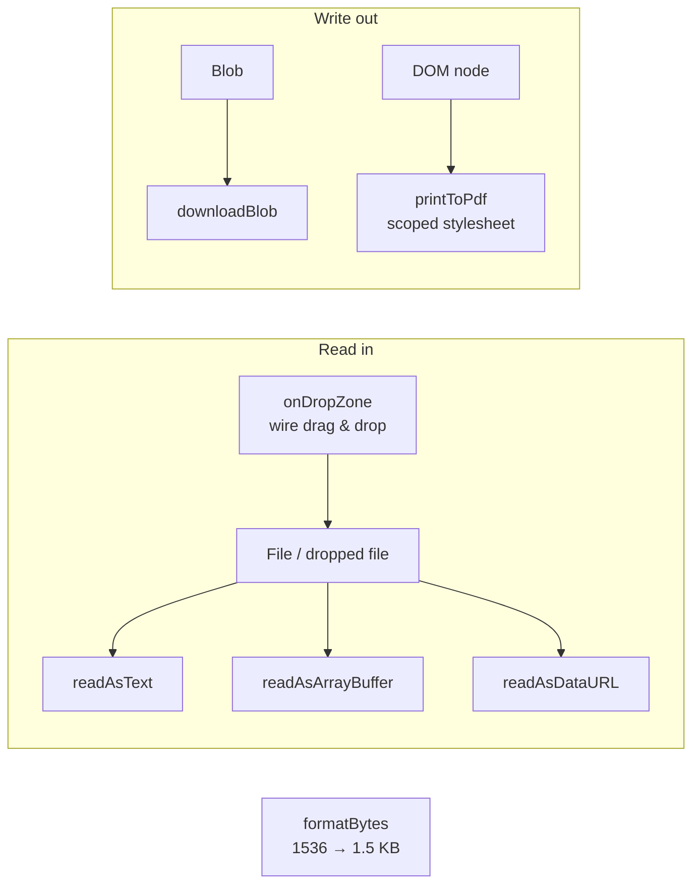

# @chirag127/oz-file

> Framework-agnostic, ZERO-dependency browser file helpers — FileReader promises, Blob download, drag-drop wiring, scoped print-to-PDF, and byte formatting. Works in Astro, Next, Vue, Svelte, or plain HTML.

[](https://www.npmjs.com/package/@chirag127/oz-file)
[](LICENSE)
[](https://github.com/chirag127/oz-file/stargazers)
[](https://github.com/chirag127/oz-file/commits)

**npm:** https://www.npmjs.com/package/@chirag127/oz-file · **GHP landing:** https://chirag127.github.io/oz-file/ · **Repo:** https://github.com/chirag127/oz-file

If this is useful, please ⭐ [star the repo](https://github.com/chirag127/oz-file) — it helps others find it.

## What it does



## Features

- **Zero dependencies** — pure native browser APIs, tiny bundle.
- **Framework-agnostic** — no React/Vue/Svelte coupling; import anywhere, including plain HTML.
- **Promise-wrapped `FileReader`** — `readAsText`, `readAsArrayBuffer`, `readAsDataURL`.
- **One-call download** — `downloadBlob(blob, filename)`.
- **Drag-and-drop wiring** — `onDropZone` returns a teardown function.
- **Scoped print-to-PDF** — `printToPdf(node?)` with a print stylesheet.
- **Byte formatting** — `formatBytes` for human-readable sizes.

## API

| Export | What it does |
|---|---|
| `readAsArrayBuffer(file)` | Promise-wrapped `FileReader` → `ArrayBuffer` |
| `readAsDataURL(file)` | Promise-wrapped `FileReader` → base64 data URL |
| `readAsText(file, encoding?)` | Promise-wrapped `FileReader` → text |
| `downloadBlob(blob, filename)` | Trigger a browser download of a `Blob` |
| `onDropZone(el, cb, opts?)` | Wire drag-and-drop; returns a teardown fn |
| `printToPdf(node?)` | `window.print()` with a scoped print stylesheet |
| `formatBytes(bytes, decimals?)` | `1536 → "1.5 KB"` |

## Tech stack

- **TypeScript**, built with **tsup** (ESM + `.d.ts`)
- **vitest** for tests
- No runtime dependencies

## Repo structure

```
oz-file/
├── src/
│   ├── index.ts       # re-exports the public API
│   ├── read.ts        # readAsText / readAsArrayBuffer / readAsDataURL
│   ├── download.ts    # downloadBlob
│   ├── dropzone.ts    # onDropZone (returns teardown)
│   ├── print.ts       # printToPdf (scoped stylesheet)
│   └── format.ts      # formatBytes
├── test/              # vitest
├── tsup.config.ts
└── package.json
```

## Install

```sh
npm i @chirag127/oz-file
```

## Usage

```ts
import {
  readAsText,
  downloadBlob,
  onDropZone,
  printToPdf,
  formatBytes,
} from '@chirag127/oz-file'

// Read a dropped file
const teardown = onDropZone(document.getElementById('drop')!, async (files) => {
  const text = await readAsText(files[0])
  console.log(`${files[0].name} — ${formatBytes(files[0].size)}`)
})

// Download generated output
downloadBlob(new Blob(['hello'], { type: 'text/plain' }), 'note.txt')

// Print just the invoice node to PDF
printToPdf(document.getElementById('invoice')!)

teardown() // remove drop listeners
```

## Configuration

No configuration required — no env vars. Everything is driven by the function arguments above.

## Part of the oriz family

`oz-file` is a shared building block behind the [oriz](https://blog.oriz.in) family — ~80 small tools, all running **$0 on the Cloudflare free tier**. It powers file read/download/print in tools like [oriz-md](https://md.oriz.in) and [oriz-qr](https://qr.oriz.in), and pairs with sibling package [`@chirag127/oz-chrome`](https://www.npmjs.com/package/@chirag127/oz-chrome) (shared Astro chrome).

## Contributing

Issues and PRs welcome. Keep it zero-dependency and framework-agnostic; add a vitest case for any new export. Conventional commits are the changelog.

## Status

Published on npm and used across the oriz fleet.

## License

MIT © Chirag Singhal — chirag@oriz.in
